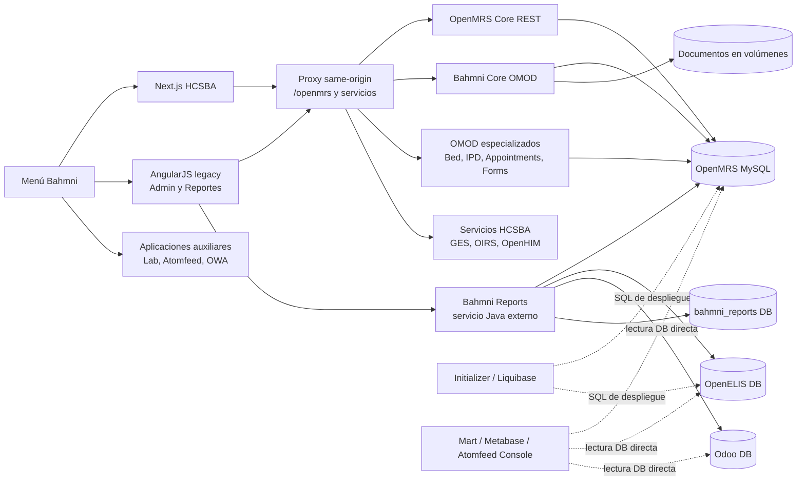
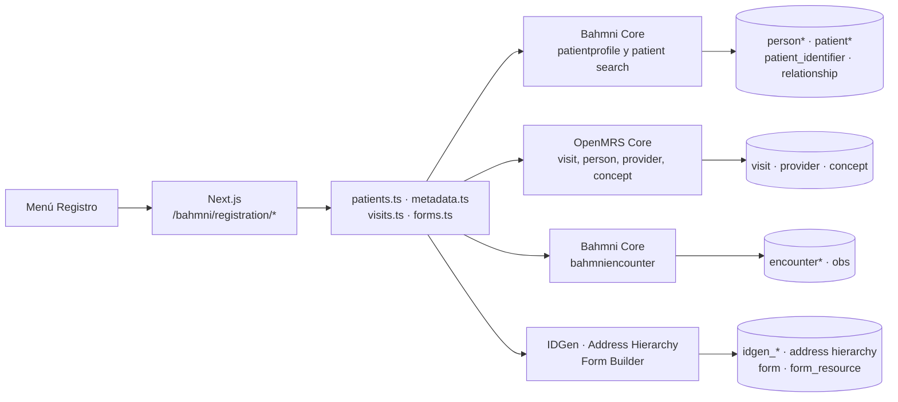
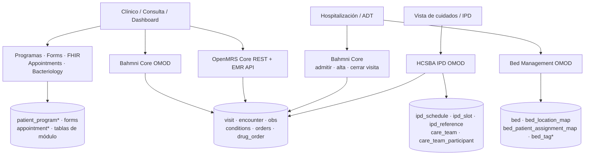
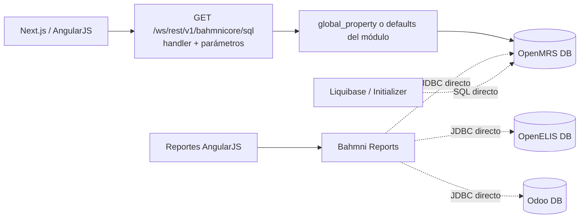

# Mapa de flujos, backends y persistencia de Bahmni HCSBA

Fecha de corte: **18 de agosto de 2026**.

Este documento responde, para cada acceso funcional, qué frontend atiende la
ruta, qué contrato HTTP utiliza, qué módulo o servicio es dueño de ese
contrato y qué familia de datos persiste. También separa las consultas SQL
directas de las consultas SQL ejecutadas detrás de una API Java.

La fuente estructurada y validable es
[`backend-flow-catalog.json`](./backend-flow-catalog.json). El inventario se
comprueba con `npm run audit:backend-map`.

## Cómo leer el mapa

Cada salto tiene uno de estos niveles de evidencia:

- **Confirmado:** existe evidencia local del endpoint, SQL, tabla o wiring de
  despliegue.
- **Derivado:** la relación corresponde al modelo de OpenMRS/Bahmni o al
  módulo upstream, pero aún no se inspeccionó el artefacto exacto instalado en
  `.205`.
- **Pendiente:** falta el contrato del ambiente o de un sistema externo.

Una familia de tablas indica propiedad y acoplamiento; no debe interpretarse
como autorización para consultarlas directamente. OpenMRS sigue siendo la
autoridad de los datos clínicos mientras no exista una extracción de dominio
formal.

## Vista general



No se encontró acceso a base de datos desde el navegador en los servicios
Next.js revisados. Los bypass de API señalados arriba ocurren del lado servidor
o durante el despliegue.

## Matriz menú → backend → datos

| Menú o dominio | Frontend/ruta | Contrato principal | Dueño backend | Persistencia principal | Estado |
|---|---|---|---|---|---|
| Inicio, login y ubicación | Next.js `/bahmni/home`, `/login`, `/location` | `/ws/rest/v1/session`, `user`, `provider`, `location`; OIDC opcional | OpenMRS Core, Bahmni Core, Keycloak + OAuth2 Login | `users`, roles/privilegios, `provider*`, `location*`, `global_property`; PostgreSQL Keycloak | Mixto confirmado/derivado |
| Registro | Next.js `/bahmni/registration/*` | `bahmni/search/patient`, `patientprofile`, `visit`, `bahmniencounter`, `idgen`, Address Hierarchy | Bahmni Core, OpenMRS Core, IDGen, Address Hierarchy, Form Builder | `person*`, `patient*`, identificadores, relaciones, `visit`, `encounter`, `obs`, formularios | Mixto confirmado/derivado |
| Clínico, consulta, dashboard y programas | Next.js `/bahmni/clinical/*` | `bahmnicore/bahmniencounter`, diagnósticos, observaciones, órdenes, EMR API, alergias, programas | Bahmni Core, OpenMRS Core/EMR API y OMOD clínicos | `visit`, `encounter*`, `obs`, `conditions`, `orders`, `drug_order`, alergias, programas | Derivado con contratos frontend confirmados |
| Hospitalización, ADT y camas | Next.js `/bahmni/adt/*`, `/bedmanagement/*` | admisión/alta/fin de visita; `admissionLocation`, `beds`, `bedTag`; handlers SQL | Bahmni Core y Bed Management OMOD | `visit`, `encounter`, `obs`, `bed*`, asignaciones paciente-cama, `location` | Mixto confirmado/derivado |
| Vista de cuidados e IPD | Next.js care view y dashboard IPD | `/ipd/wards`, schedules, medication, care team, administrations | HCSBA IPD OMOD `1.1.1-hcsba.5` | `ipd_schedule`, `ipd_slot`, `ipd_reference`, `care_team*`, órdenes y administraciones | Confirmado |
| Documentos | Next.js `/bahmni/document-upload/*` | `bahmnicore/visitDocument*`, encounter y rutas estáticas | Bahmni Core + Nginx patient-documents | `encounter`, `obs`, `visit` y volúmenes de documentos/resultados | Confirmado |
| Órdenes | Next.js `/bahmni/orders/*` y consulta | `order*`, `bahmnicore/orders*`, `drugOrders*` | OpenMRS Core y Bahmni Core | `orders`, `drug_order`, frecuencias, tipos, fármacos y conceptos | Derivado |
| Citas | Next.js `/bahmni/appointments/*` | `appointment*`, `recurring-appointments`, servicios y especialidades | Appointments OMOD | `patient_appointment*`, `appointment_service*`, especialidades y disponibilidades | Derivado |
| Reportes | AngularJS `/bahmni/reports/#/*` | `/bahmnireports/*` | Servicio Java Bahmni Reports, no OMOD | JDBC directo a OpenMRS, OpenELIS y Odoo; DB/volumen de reportes | Confirmado |
| Administración | AngularJS `/bahmni/admin/#/*` | import/export, auditlog, order sets y FHIR | Bahmni Core y OMOD especializados | `import_status`, `audit_log`, conceptos, order sets, datos exportados | Mixto confirmado/derivado |
| Integraciones | Controles dashboard y apps auxiliares | `/apinotificacion/ges*`, OIRS, `/openmrs/ips-mediator/*` | Servicios HCSBA/OpenHIM; pabellón institucional futuro | Persistencia externa no presente en el workspace | Mixto confirmado/pendiente |

## Flujo de Registro



El guardado de una ficha no es una sola tabla: combina identidad de la persona,
rol de paciente, identificadores, relaciones, visita y, según el formulario,
encuentros/observaciones. Al reemplazar este dominio no basta con reproducir un
`INSERT patient`.

## Flujo clínico, ADT e IPD



La admisión, la cama y la visita son estados relacionados pero distintos. Una
visita IPD activa no demuestra por sí sola que exista una asignación de cama
vigente; esa afirmación debe comprobarse contra
`bed_patient_assignment_map`. Asimismo, liberar una cama y cerrar la visita son
operaciones separadas del contrato ADT.

## SQL nativo detrás de una API vs. bypass de API



`/bahmnicore/sql` **no es acceso directo del frontend a la base**: existe una
frontera HTTP y el OMOD decide qué sentencia corresponde al nombre del handler.
Sí es un contrato frágil porque su resultado depende de SQL configurable en
`global_property`. Antes de reemplazarlo debe exportarse el valor efectivo de
cada handler en `.205`.

Los bypass reales encontrados son:

| Camino | Tipo | Bases/tablas visibles en evidencia | Influencia |
|---|---|---|---|
| Bahmni Reports `MRSGeneric` y reportes built-in | JDBC en runtime | OpenMRS; ejemplo `obs`, `person`, `concept_view`, `concept_name`, `conditions` | Reportes clínicos |
| Bahmni Reports `ElisGeneric` | JDBC en runtime | OpenELIS; ejemplo `result` | Reportes de laboratorio |
| Bahmni Reports `ERPGeneric` | JDBC en runtime | Odoo; ejemplo `account_move` | Reportes de facturación |
| Initializer/Liquibase OpenMRS | SQL en despliegue | usuarios/providers, roles, conceptos, global properties, scheduler y metadatos | Configuración y datos maestros |
| Migraciones OpenELIS | SQL en despliegue | `organization`, `site_information` | Configuración de laboratorio |
| Bahmni Mart | ETL en runtime | lectura OpenMRS y escritura `martdb` | Analítica |
| Metabase | Lectura analítica directa | OpenMRS, `martdb`, `metabasedb` | Dashboards analíticos |
| Atomfeed Console | Acceso operacional directo | OpenMRS, OpenELIS y Odoo | Diagnóstico/reproceso de feeds |

Los SQL confirmados en configuración están en
[`diagnosisCount.sql`](../../../standard-config-HCSBA/openmrs/apps/reports/sql/diagnosisCount.sql),
[`testCount.sql`](../../../standard-config-HCSBA/openmrs/apps/reports/sql/testCount.sql) y
[`odooInvoiceSummary.sql`](../../../standard-config-HCSBA/openmrs/apps/reports/sql/odooInvoiceSummary.sql).
El wiring de bases se encuentra en
[`docker-compose.yml`](../../../bahmni-docker-HCSBA/bahmni-standard/docker-compose.yml).

## Handlers SQL que afectan flujos funcionales

Estos nombres están confirmados por el frontend/configuración, aunque todavía
falta capturar la sentencia efectiva instalada:

- `emrapi.sqlSearch.activePatients`
- `emrapi.sqlSearch.activePatientsByProvider`
- `emrapi.sqlSearch.activePatientsByLocation`
- `emrapi.sqlSearch.patientsToAdmit`
- `emrapi.sqlSearch.admittedPatients`
- `emrapi.sqlSearch.patientsToDischarge`
- `bedManagement.sqlGet.patientListForAdmissionLocation`
- `bahmni.sqlGet.upComingAppointments`
- `bahmni.sqlGet.pastAppointments`

Son especialmente importantes para listas clínicas, admisión/alta y citas: una
migración de backend que ignore esos filtros puede devolver pacientes distintos
a legacy aunque los endpoints nuevos funcionen técnicamente.

## Fronteras recomendadas para una migración futura a Go

El orden seguro no es “tabla por tabla”, sino contrato funcional por contrato
funcional:

1. Congelar para un menú sus requests, respuestas, privilegios, side effects,
   auditoría y eventos Atomfeed.
2. Encapsular handlers SQL y lecturas directas detrás de un contrato HTTP
   versionado antes de cambiar lenguaje o base.
3. Sustituir un dueño backend manteniendo a OpenMRS como autoridad de sus tablas
   clínicas durante la transición.
4. Comparar semánticamente Java/legacy contra Go con fixtures anonimizados.
5. Recién después retirar el endpoint Java, el SQL directo o el OMOD.

Los mayores acoplamientos para esa evolución son Reportes, Mart/Metabase,
Atomfeed Console, Initializer/Liquibase y los handlers configurables de
`/bahmnicore/sql`. Los OMOD especializados tienen una frontera más clara, pero
pueden producir auditoría, eventos o efectos secundarios que no aparecen en el
payload REST.

## Evidencia y mantenimiento

Fuentes locales principales:

- Clientes HTTP Next.js: [`src/services/bahmni`](../../src/services/bahmni).
- Configuración de menús: [`extension.json`](../../../standard-config-HCSBA/openmrs/apps/home/extension.json).
- Configuración de reportes: [`reports.json`](../../../standard-config-HCSBA/openmrs/apps/reports/reports.json).
- IPD HCSBA: [`openmrs-module-ipd`](../../../openmrs-module-ipd).
- Despliegue y conexiones de servicios: [`docker-compose.yml`](../../../bahmni-docker-HCSBA/bahmni-standard/docker-compose.yml).
- Catálogo máquina-legible: [`backend-flow-catalog.json`](./backend-flow-catalog.json).

Fuentes upstream utilizadas para las relaciones derivadas:

- [Bahmni Core](https://github.com/Bahmni/bahmni-core)
- [OpenMRS Bed Management](https://github.com/openmrs/openmrs-module-bedmanagement)
- [Bahmni Appointments](https://github.com/Bahmni/openmrs-module-appointments)
- [Bahmni Reports](https://github.com/Bahmni/bahmni-reports)

Al agregar o cambiar un menú:

1. Actualizar el flujo correspondiente en `backend-flow-catalog.json`.
2. Adjuntar una ruta de evidencia local por cada contrato nuevo.
3. Marcar como `derived` o `pending` todo lo que no esté comprobado.
4. Ejecutar:

   ```bash
   npm run audit:backend-map
   ```

El validador comprueba IDs, estructura, niveles de confianza y existencia de
las evidencias locales. No reemplaza una inspección del OMOD desplegado ni una
comparación del esquema real.

## Brechas aún abiertas

- Inventariar nombre y versión exacta de todos los OMOD activos en `.205`.
- Exportar valores efectivos de `emrapi.sqlSearch.*`,
  `bedManagement.sqlGet.*` y `bahmni.sqlGet.*`.
- Comparar el esquema desplegado con las familias de tablas marcadas como
  derivadas.
- Obtener contratos de propiedad/API para OIRS, GES y el sistema institucional
  de pabellón.
- Trazar por separado payloads y checkpoints Atomfeed de OpenELIS y Odoo.

Hasta cerrar esas brechas, el mapa es apto para análisis de impacto y
planificación, pero las relaciones `derived` no deben usarse como contrato SQL
de una reimplementación.
